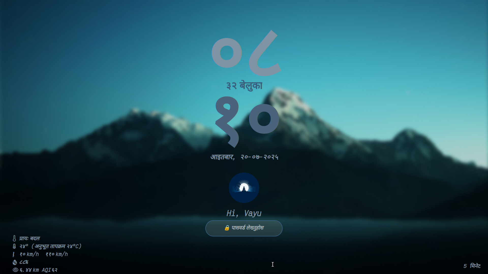
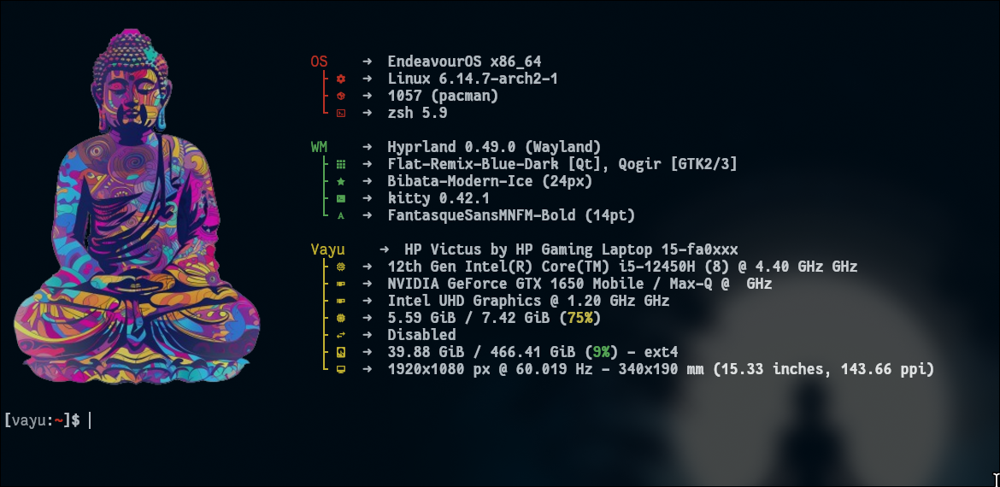
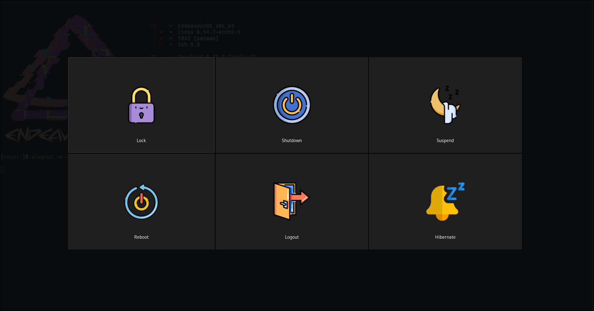

# Devanagari-Hyprland
Hyprland inspired by <a href="https://github.com/JaKooLit/Arch-Hyprland">JaKoolIt </a>
<h3>Preview</h3>

<table align="center">
  <tr><td></td></tr>
  <tr><td align="center">waybar</td></tr>
</table>

<table align="center">
  <tr><td></td></tr>
  <tr><td align="center">Hyprlock</td></tr>
</table>

<table align="center">
  <tr><td></td></tr>
  <tr><td align="center">Fastfetch</td></tr>
</table>

<table align="center">
  <tr><td></td></tr>
  <tr><td align="center">Rofi</td></tr>
</table>
<table align="center">
  <tr><td></td></tr>
  <tr><td align="center">Wlogout</td></tr>
</table>

