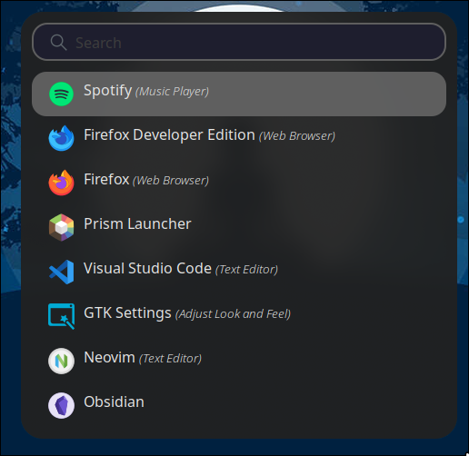

    # Devanagari-Hyprland
    <h4>Disclaimer: I haven’t tested this setup on vanilla Hyprland. Please make sure to read through the config before copy-pasting, there might be some errors depending on your system.</h4>

    Hyprland inspired by <a href="https://github.com/JaKooLit/Arch-Hyprland">JaKoolIt. </a>In this Hyprland setup, I’ve tried to add Devanagari numbers and scripts as much as possible by tinkering with the config files mentioned above.I’ve also modified and used parts of other people’s rices, though the overall theme across Hyprland is not fully uniform.

    <h3>Additional Features</h3>
    <ul>
      <li>Time and date, weather, and workspace shown in Devanagari script</li>
      <li>Custom low battery sound notification and flickring of battery</li>
      <li>Full description of PC along with Memory usage in fastfetch</li>
      <li>Tried to maintain dark theme across wayland</li>
    </ul>

    <h3>Additional programs needed:</h3>
    <ul>
      <li>btop++ (system monitor)</li>
      <li>nvtop (GPU monitor)</li>
      <li>ttf-font-awesome(to display icons)</li>
      <li>Text editor(i.e Mousepad,Nvim etc)</li>   
    </ul>

    <h3>Preview</h3>
    

    <table align="center">
      <tr><td></td></tr>
      <tr><td align="center">waybar</td></tr>
    </table>

    <table align="center">
      <tr><td></td></tr>
      <tr><td align="center">Hyprlock</td></tr>
    </table>

    <table align="center">
      <tr><td></td></tr>
      <tr><td align="center">Fastfetch</td></tr>
    </table>

    <table align="center">
      <tr><td></td></tr>
      <tr><td align="center">Rofi</td></tr>
    </table>
    <table align="center">
      <tr><td></td></tr>
      <tr><td align="center">Wlogout</td></tr>
    </table>
